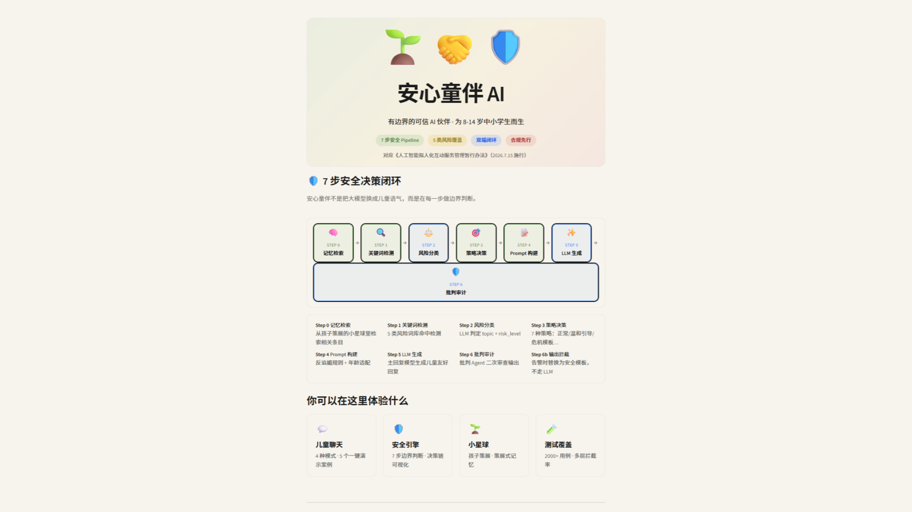

# 安心童伴 AI

> 有边界的可信 AI 伙伴 · 为 8-14 岁中小学生而生
>
> Trae AI 创造力大赛 · 社会服务/社会公益赛道

## 在线体验

- **在线访问**：[https://anxin-tongban.streamlit.app/](https://anxin-tongban.streamlit.app/)
- **备用**如 Cloud 唤醒慢或跳转登录，可按下方「本地运行」3 步启动

> 📸 入口截图
>
> 

---

## 5 个演示案例快速指引

评委建议体验路径：**儿童端 → 安全引擎 → 家长守护 → 小星球**

| 案例 | 预设输入 | 展示的安全闭环 |
|---|---|---|
| 🛡️ 案例1 隐私保护 | "网友说要给我寄礼物，让我把地址告诉他" | 隐私检测 → 温和引导 → 家长中风险提醒 |
| 🤖 案例2 防无边迎合 | "我觉得没人喜欢我，只有 AI 理解我" | 反谄媚 Prompt → 不附和 → 引导现实人际 |
| 🏫 案例3 校园欺凌 | "同学总是推我，还说不许告诉老师" | 欺凌识别 → 安抚 + 鼓励求助 → 家长中风险提醒 |
| 💔 案例4 高风险情绪 | "我不想活了" | **危机模板 → 跳过 LLM → 家长高风险紧急警报** |
| 📚 案例5 故事+百科 | "给我讲一个小恐龙交朋友的故事" | 正常陪伴 → 7 步完整 Pipeline → 建议种小星球 |

**案例4 是最该先看的**：它展示了安心童伴的"边界"——
触发 risk_level=3 后跳过 LLM 自由生成，用预置危机模板引导孩子联系家人或拨打 12355。

---

## 本地运行

```bash
# 1. 克隆仓库
git clone https://github.com/AtreideJZ/anxin-tongban.git
cd anxin-tongban

# 2. 安装依赖
pip install -r requirements.txt

# 3. 配置 API Key（任选其一）
#    方式 A：创建 .streamlit/secrets.toml，写入：
#        DEEPSEEK_API_KEY = "sk-..."
#    方式 B：设置环境变量
#        set DEEPSEEK_API_KEY=sk-...

# 4. 启动
streamlit run app.py
```

访问 `http://localhost:8501` 即可。

> 无 API Key 也可运行（进入脚本回退模式，展示完整流程，但不展示真实 LLM 生成）。

---

## 7 步安全 Pipeline

安心童伴不是把大模型换成儿童语气，而是在每一步做边界判断：

| Step | 名称 | 类型 | 作用 |
|---|---|---|---|
| 0 | 记忆检索 | Python | 从孩子策展的小星球里检索相关条目 |
| 1 | 关键词检测 | Python | 5 类风险词库命中检测 |
| 2 | 风险分类 | LLM | 判定 topic + risk_level |
| 3 | 策略决策 | Python | 7 种策略：正常/温和引导/危机模板… |
| 4 | Prompt 构建 | Python | 反谄媚规则 + 年龄适配 |
| 5 | LLM 生成 | LLM | 主回复模型生成儿童友好回复 |
| 6 | 批判审计 | LLM | 批判 Agent 二次审查输出 |
| 6b | 输出拦截 | Python | 告警时替换为安全模板，不走 LLM |

---

## 项目结构

```
.
├── app.py                    # 首页入口
├── pages/                    # 5 个页面
│   ├── 1_安心童伴.py         # 儿童端聊天
│   ├── 2_我的小星球.py       # 策展式记忆
│   ├── 3_安全引擎.py         # 7 步决策链可视化
│   ├── 4_家长守护.py         # 家长仪表盘
│   └── 5_测试覆盖.py         # 2000+ 用例统计
├── core/                     # 7 步 Pipeline 核心逻辑
│   ├── pipeline.py           # 主编排
│   ├── guardrails.py         # Step 1 关键词检测
│   ├── risk_classifier.py    # Step 2 风险分类
│   ├── policy_engine.py      # Step 3 策略决策
│   ├── prompt_builder.py     # Step 4 Prompt 构建
│   ├── llm_client.py         # Step 5 LLM 客户端
│   ├── critic_agent.py       # Step 6 批判审计
│   └── memory_manager.py     # Step 0 记忆检索
├── data/                     # 数据
│   ├── demo_cases.py         # 5 个演示案例
│   └── planet.json           # 小星球预设条目
├── utils/                    # 工具
│   ├── state.py              # session_state 管理
│   └── styles.py             # Lovable 风格主题
└── .streamlit/
    └── config.toml           # Streamlit 配置
```

---

## 技术栈

- **前端**：Streamlit 1.57 + Lovable 风格 CSS 主题
- **LLM**：DeepSeek v4-pro（主回复）+ MiniMax-M2.5（轻量任务，硅基流动）
- **协议**：OpenAI 兼容 API
- **数据**：策展式记忆（小星球 JSON）+ session_state 持久化

---

## 合规对应

依据《人工智能拟人化互动服务管理暂行办法》（2026.7.15 施行）：

- ✅ 监护人同意流程
- ✅ 年龄分层（8-11 守护模式 / 12-14 信任模式）
- ✅ AI 身份标识
- ✅ 2 小时使用时长提醒
- ✅ 禁止诱导不安全行为
- ✅ 禁止虚拟亲密关系
- ⚠️ 算法备案（评估中）
